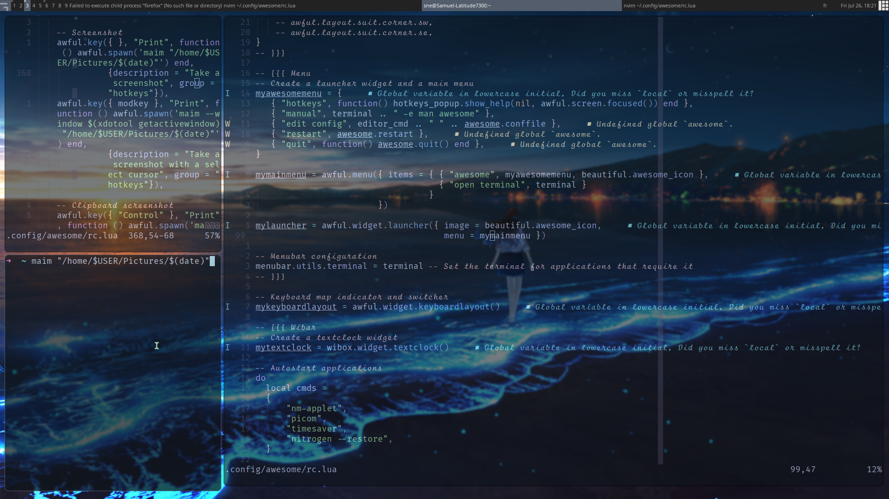

# Dotfiles configuration

This is my personal configuration for my Linux setup. Currently, I am using
awesome window manager with Artix so the repo is not up to date.

## Screenshot


## Software Stack Configuration
- **Distro**: [Fedora i3](https://fedoraproject.org/spins/)
- **Shell**: [zsh](https://www.zsh.org/)
- **Terminal**: [kitty](https://sw.kovidgoyal.net/kitty/)
- **Code Editors**: [Nvim](https://github.com/neovim/neovim), [Visual Studio Code ](https://code.visualstudio.com/)
- **Browsers**: [Cute Browser](https://brave.com/), [Firefox]()
- **Application launcher:**: [Rofi](https://github.com/davatorium/rofi)
- **Compositor:**: [Picom of pijulius](https://github.com/pijulius/picom)
- **File Manager**: [Ranger](https://github.com/ranger/ranger)
- **Notifications**: [dunst](https://github.com/dunst-project/dunst)
- **Font**: [ShureTechMono Nerd Font](https://www.nerdfonts.com/font-downloads)
- **Cursors**: [Catppuccin-Macchiato-Dark-Cursors](https://github.com/catppuccin/cursors)


## Usage
The script mostly installs or copy auto copy the config of my i3 config.

To use the script make sure to have bash install. Because I do not know if it
will work on dash or whatever.

To auto copy your config file edit the copyconfig to feel your need and adjust
the destination file path:

```shell
./copyconfig
```

To set the config:
```shell
./setup
```

For the neovim config, I have another repo for that:
```
https://github.com/Ssnnee/init.lua
```

## Todos
- [x] Write a script that auto-configure all
- [x] Test if the script setup actually work
- [ ] Switch the file manager from ranger(too slow) to nnn or lf
```shell
sh -c "$(wget https://raw.github.com/ohmyzsh/ohmyzsh/master/tools/install.sh -O -)"
git clone https://github.com/zsh-users/zsh-autosuggestions ${ZSH_CUSTOM:-~/.oh-my-zsh/custom}/plugins/zsh-autosuggestions
git clone https://github.com/zsh-users/zsh-syntax-highlighting.git ${ZSH_CUSTOM:-~/.oh-my-zsh/custom}/plugins/zsh-syntax-highlighting
git clone --depth=1 https://github.com/romkatv/powerlevel10k.git ${ZSH_CUSTOM:-$HOME/.oh-my-zsh/custom}/themes/powerlevel10k
```
